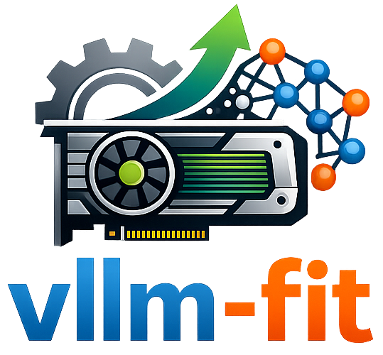

# vLLM-Fit

<p align="center">
    
</p>

A CLI tool designed to simply _recommend_ (conservative), and/or _profile_ (to maximize resource utilization) vLLM engine arguments for any HuggingFace model on the user's current hardware.


## Quick Start

```bash
# Create and activate uv environment
uv venv --seed --python 3.10
source .venv/bin/activate

# Install vLLM
uv pip install vllm --torch-backend=auto

# Install vllm-fit
uv pip install git+https://github.com/jranaraki/vllm-fit
```

Get instant parameter recommendations:

```bash
vllm-fit recommend Qwen/Qwen2.5-7B-Instruct
```

Profile to find actual memory limits:

```bash
vllm-fit profile Qwen/Qwen2.5-7B-Instruct
```

Start server with optimal settings:

```bash
vllm-fit serve Qwen/Qwen2.5-7B-Instruct
```

## Features

- **Static Estimation**: Instant parameter recommendations from model config
- **Dynamic Profiling**: Tests real memory usage to find actual limits
- **Multi-GPU Support**: Automatic tensor parallel configuration
- **Smart Fail Handling**: Graceful errors when VRAM insufficient
- **Optimized Output**: Clean logs without vLLM noise

## Commands

### `recommend` - Quick parameter suggestions

```
vllm-fit recommend <model_id> [--gpuid <ids>]
```

Returns estimated optimal parameters without running the model.

### `profile` - Find actual memory limits

```
vllm-fit profile <model_id> [--gpuid <ids>]
```

Tests different configurations to find what actually fits your GPU.

### `serve` - Start vLLM server

```
vllm-fit serve <model_id> [--gpuid <ids>]
```

Profiles then starts optimized vLLM OpenAI-compatible server.

### GPU Selection

Use `--gpuid` to control which GPUs are used:

- `--gpuid 0` - Use GPU 0 only
- `--gpuid 0,1,2` - Use GPUs 0, 1, and 2
- `--gpuid all` (default) - Use all available GPUs

## Output

After profiling, you get:

```
✓ Profiling completed successfully!

Summary:
  • Attempted 3 configurations
  • Final test: Memory=0.80, Len=4096
  • Strategy: Used --enforce-eager mode for memory efficiency
  • Time elapsed: 45s

╭────────────────────────────────── Dynamic Profiling ──────────────────────────────────╮
│ Optimized Parameters                                                                  │
╰───────────────────────────────────────────────────────────────────────────────────────╯
model_id: Qwen/Qwen2.5-7B-Instruct
gpu_memory_utilization: 0.80
max_model_len: 4096
tensor_parallel_size: 1
max_num_seqs: 16
enforce_eager: True

Run this command:
vllm serve Qwen/Qwen2.5-7B-Instruct --gpu_memory_utilization 0.80 --max_model_len 4096 --tensor_parallel_size 1 --max_num_seqs 16 --enforce-eager
```

## Requirements

- **vLLM** - Install separately (see vLLM installation docs for your CUDA version)
- NVIDIA GPU with CUDA support
- CUDA-capable drivers (`nvidia-smi` working)
- PyTorch with CUDA support
- 4GB VRAM minimum (recommended 8GB+)

## Troubleshooting

### "No GPU detected"

1. Check `nvidia-smi` shows your GPU
2. Verify CUDA: `python -c "import torch; print(torch.cuda.is_available())"`
3. Install PyTorch with CUDA: `pip install torch --index-url https://download.pytorch.org/whl/cu118`
4. Update NVIDIA drivers from https://developer.nvidia.com/cuda-downloads

### Model won't fit?

Try:
- Use `--enforce-eager` flag (added automatically by vllm-fit)
- Try a quantized model (AWQ, GPTQ, 4-bit/8-bit)
- Use a smaller model variant
- Get more GPUs for larger models

## How It Works

1. **Fetches model config** from Hugging Face
2. **Estimates parameters** based on model architecture and available VRAM
3. **Profiles** by testing actual vLLM engine with different settings
4. **Iteratively adjusts** memory, sequence length, and batch size until successful
5. **Returns exact command** to run with optimal parameters

## Notes

1. For some of the older GGUF models on HuggingFace, there might be the ones that did not follow the naming convention accurately. Therefore, you might need to rename them before deployment. For instance, when you run `vllm-fit recommend Qwen/Qwen3-0.6B-GGUF:Q8_0`, the recommended arguments `vllm serve Qwen/Qwen3-0.6B-GGUF:Q8_0 --gpu_memory_utilization 0.65 --max_model_len 3914 --tensor_parallel_size 1 --max_num_seqs 8 --hf-config-path Qwen/Qwen3-0.6B --tokenizer Qwen/Qwen3-0.6B --enforce-eager` works just fine since the model name in the `~/.cache/huggingface/hub/models--Qwen--Qwen3-0.6B-GGUF/snapshots/23749fefcc72300e3a2ad315e1317431b06b590a` is as expected (see `Qwen3-0.6B-Q8_0.gguf`), where the quantization substring is `Q8_0`. However, when you run `vllm-fit recommend Qwen/Qwen2-0.5B-Instruct-GGUF:Q8_0`, although the provided recommendation is correct, `vllm serve Qwen/Qwen2-0.5B-Instruct-GGUF:Q8_0 --gpu_memory_utilization 0.65 --max_model_len 6098 --tensor_parallel_size 1 --max_num_seqs 8 --hf-config-path Qwen/Qwen2-0.5B-Instruct --tokenizer Qwen/Qwen2-0.5B-Instruct --enforce-eager`, since the downloaded model's name did not follow the naming convention, you will get this error from vLLM `ValueError: Downloaded GGUF files not found in /home/USER/.cache/huggingface/hub/models--Qwen--Qwen2-0.5B-Instruct-GGUF/snapshots/198f08841147e5196a6a69bd0053690fb1fd3857 for quant_type Q8_0` since the model name is `qwen2-0_5b-instruct-q8_0.gguf`. To fix this, rename the model, in the cache `/home/USER/.cache/huggingface/hub/models--Qwen--Qwen2-0.5B-Instruct-GGUF/snapshots/198f08841147e5196a6a69bd0053690fb1fd3857`, from `qwen2-0_5b-instruct-q8_0.gguf` to `qwen2-0_5b-instruct-Q8_0.gguf`. 

## Citing

If you find vllm-fit useful and interested in citing this work, please use the following BibTex entry:

```
@software{vllmfit2026,
  author = {Javad Anaraki},
  title = {vllm-fit: Hardware-Aware vLLM Argument Recommendation and Profiling},
  url = {https://github.com/jranaraki/vllm-fit},
  version = {0.2.0},
  year = {2026},
}
```

## Acknowledgments

- [llmfit](https://github.com/AlexsJones/llmfit) for the inspiration 